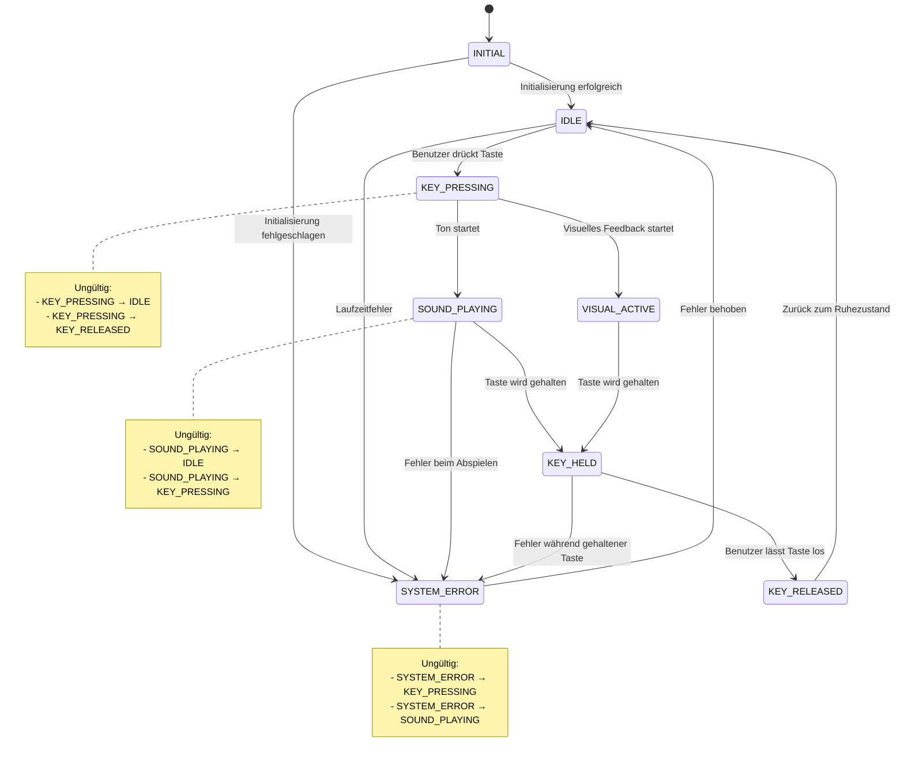

# VibeCodingPlaybook-Piano Zustandsübergänge

## Systemzustände

### 1. INITIAL
Das System wird initialisiert, Audio-Kontext wird erstellt, aber noch nicht bereit für Benutzereingaben.

### 2. IDLE
Das System ist bereit und wartet auf Benutzereingaben. Kein Ton wird abgespielt, kein visuelles Feedback aktiv.

### 3. KEY_PRESSING
Eine Taste wurde gerade gedrückt (Mouse down oder Tastatur-Taste down). Der Zustand ist kurzlebig und führt sofort zu SOUND_PLAYING und VISUAL_ACTIVE.

### 4. SOUND_PLAYING
Ein Ton wird gerade abgespielt. Dieser Zustand bleibt aktiv, solange die Taste gehalten wird.

### 5. VISUAL_ACTIVE
Das visuelle Feedback (Hintergrundleuchten) ist aktiv. Dies kann unabhängig vom Sound bestehen bleiben für einen kurzen Nachleucht-Effekt.

### 6. KEY_HELD
Eine Taste wird gehalten (Mouse down oder Tastatur-Taste gedrückt gehalten). Der Ton wird weitergespielt, das visuelle Feedback bleibt aktiv.

### 7. KEY_RELEASED
Eine Taste wurde losgelassen (Mouse up oder Tastatur-Taste up). Der Ton stoppt, das visuelle Feedback wird beendet.

### 8. SYSTEM_ERROR
Ein Fehler ist aufgetreten (z.B. Audio-Kontext konnte nicht erstellt werden). Das System ist nicht funktionsfähig.

## Gültige Zustandsübergänge

### Initialisierungsphase
- **INITIAL → IDLE**: System erfolgreich initialisiert, bereit für Benutzereingaben
- **INITIAL → SYSTEM_ERROR**: Initialisierung fehlgeschlagen (z.B. Audio nicht verfügbar)

### Benutzereingabe-Phase
- **IDLE → KEY_PRESSING**: Benutzer drückt eine Taste (Maus oder Tastatur)
- **KEY_PRESSING → SOUND_PLAYING**: Ton beginnt zu spielen
- **KEY_PRESSING → VISUAL_ACTIVE**: Visuelles Feedback wird aktiviert
- **SOUND_PLAYING → KEY_HELD**: Ton wird weitergespielt während Taste gehalten wird
- **VISUAL_ACTIVE → KEY_HELD**: Visuelles Feedback bleibt aktiv während Taste gehalten wird
- **KEY_HELD → KEY_RELEASED**: Benutzer lässt Taste los
- **KEY_RELEASED → IDLE**: System kehrt in Ruhezustand zurück

### Fehlerbehandlung
- **IDLE → SYSTEM_ERROR**: Laufzeitfehler (z.B. Audio-Kontext geht verloren)
- **SOUND_PLAYING → SYSTEM_ERROR**: Fehler beim Abspielen
- **KEY_HELD → SYSTEM_ERROR**: Fehler während gehaltener Taste
- **SYSTEM_ERROR → IDLE**: Fehler wurde behoben (wiederhergestellt)

## Ungültige Zustandsübergänge

Die folgenden Übergänge sind nicht erlaubt und werden abgelehnt:

- **KEY_PRESSING → IDLE**: Eine Taste kann nicht direkt in IDLE übergehen, muss erst KEY_RELEASED durchlaufen
- **SOUND_PLAYING → IDLE**: Sound muss erst über KEY_RELEASED beendet werden
- **VISUAL_ACTIVE → IDLE**: Visuelles Feedback muss erst über KEY_RELEASED beendet werden
- **KEY_HELD → IDLE**: Gehaltene Taste muss erst losgelassen werden
- **KEY_RELEASED → KEY_PRESSING**: Kann nicht direkt zurückgehen, muss über IDLE
- **KEY_RELEASED → SOUND_PLAYING**: Sound kann nicht starten, wenn Taste losgelassen
- **SYSTEM_ERROR → KEY_PRESSING**: Aus Fehlerzustand kann nicht direkt in Tastendruck übergehen
- **SYSTEM_ERROR → SOUND_PLAYING**: Aus Fehlerzustand kann kein Sound starten
- **INITIAL → KEY_PRESSING**: System muss erst IDLE erreichen bevor Benutzereingaben möglich sind
- **INITIAL → SOUND_PLAYING**: System muss erst IDLE erreichen bevor Sound möglich ist

## Endzustände

### IDLE
Normaler Endzustand nach jeder Benutzereingabe. Das System ist bereit für neue Eingaben.

### SYSTEM_ERROR
Fehler-Endzustand. Das System ist nicht funktionsfähig und benötigt Wiederherstellung.

## Mermaid-Diagramm



## Protokollierung der Zustandsübergänge

Jeder Zustandsübergang erzeugt einen strukturierten Protokolleintrag mit folgenden Feldern:

### Protokollstruktur
```json
{
  "timestamp": "ISO-8601-Zeitstempel",
  "previous_state": "Vorheriger Zustand",
  "new_state": "Neuer Zustand",
  "trigger": "Auslöser des Übergangs",
  "actor": "Akteur (Benutzer|System|externes_Ereignis)",
  "correlation_id": "Eindeutige Korrelations-ID",
  "status": "success|rejected",
  "rejection_reason": "Grund bei Ablehnung (optional)"
}
```

### Beispiel für erfolgreiche Übergänge

#### Beispiel 1: Tastendruck
```json
{
  "timestamp": "2026-08-29T14:32:15.123Z",
  "previous_state": "IDLE",
  "new_state": "KEY_PRESSING",
  "trigger": "Maus-Click auf Taste C4",
  "actor": "Benutzer",
  "correlation_id": "550e8400-e29b-41d4-a716-446655440000",
  "status": "success"
}
```

#### Beispiel 2: Sound-Start
```json
{
  "timestamp": "2026-08-29T14:32:15.124Z",
  "previous_state": "KEY_PRESSING",
  "new_state": "SOUND_PLAYING",
  "trigger": "Audio-Kontext bereit für Tonerzeugung",
  "actor": "System",
  "correlation_id": "550e8400-e29b-41d4-a716-446655440000",
  "status": "success"
}
```

### Beispiel für abgelehnte Übergänge

#### Beispiel 1: Ungültiger direkter Übergang
```json
{
  "timestamp": "2026-08-29T14:32:18.456Z",
  "previous_state": "KEY_PRESSING",
  "new_state": "IDLE",
  "trigger": "Versuchter direkter Zustandswechsel",
  "actor": "System",
  "correlation_id": "550e8400-e29b-41d4-a716-446655440001",
  "status": "rejected",
  "rejection_reason": "Ungültiger Übergang: KEY_PRESSING kann nicht direkt zu IDLE übergehen. Muss KEY_RELEASED durchlaufen."
}
```

#### Beispiel 2: Systemfehler
```json
{
  "timestamp": "2026-08-29T14:33:22.789Z",
  "previous_state": "SOUND_PLAYING",
  "new_state": "SYSTEM_ERROR",
  "trigger": "Audio-Kontext verloren",
  "actor": "externes_Ereignis",
  "correlation_id": "550e8400-e29b-41d4-a716-446655440002",
  "status": "success"
}
```

## Korrelations-ID-Generierung

Die Korrelations-ID ist eine UUID v4, die für jede Benutzereingabe (Tastendruck) generiert wird und alle damit verbundenen Zustandsübergänge gruppiert:

- Eine Korrelations-ID umfasst: KEY_PRESSING → SOUND_PLAYING → VISUAL_ACTIVE → KEY_HELD → KEY_RELEASED → IDLE
- Bei Fehlern wird eine neue Korrelations-ID für die Fehlerbehandlung generiert
- Systemübergänge (INITIAL → IDLE) erhalten eigene Korrelations-IDs

## Auslöser-Kategorien

### Benutzer-Auslöser
- "Maus-Click auf Taste [Note]"
- "Maus-Release auf Taste [Note]"
- "Tastatur-Taste [Key] gedrückt"
- "Tastatur-Taste [Key] losgelassen"

### System-Auslöser
- "Audio-Kontext bereit für Tonerzeugung"
- "Visuelles Feedback initialisiert"
- "Timer für Nachleucht-Effekt abgelaufen"
- "Initialisierung abgeschlossen"

### Externe Ereignisse
- "Audio-Kontext verloren"
- "Browser-Tab inaktiv geworden"
- "Audio-Autoplay-Blockierung durch Browser"
